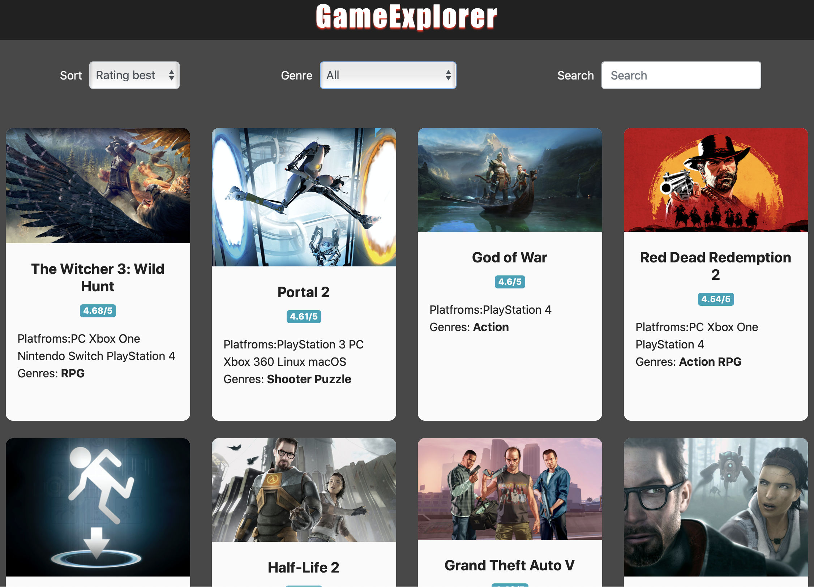

# GameExplorer (React Capstone Project)

This is the app where you can view different games, it's information, ratings, and games of similar genre. Also you can set search conditions and sort, filter by genre.

## Live Demo

[Live Demo Link](http://game-explorer.herokuapp.com/)

## Built With

- React
- Redux
- React Hooks
- CSS Modules
- React Router
- Webpack
- Bootstrap
- PropTypes

## Getting Started

To get a local copy up and running follow these simple example steps.

### Setup
    git clone https://github.com/webmarkyn/game-explorer
    cd game-explorer
### Install
    npm install
### Run development server
    npm start
### Build
    npm run build
### Deployment
    heroku create $APP_NAME --buildpack mars/create-react-app
    git push heroku master

## Authors

👤 **Mark Baidebura**

- Github: [@webmarkyn](https://github.com/webmarkyn)
- Linkedin: [linkedin](https://www.linkedin.com/in/mark-baidebura/)
- Twitter: [@webmarkyn](https://twitter.com/webmarkyn)

## Future updates  

- Improve UI
- Add more games
- Add library of games
- User Profile

